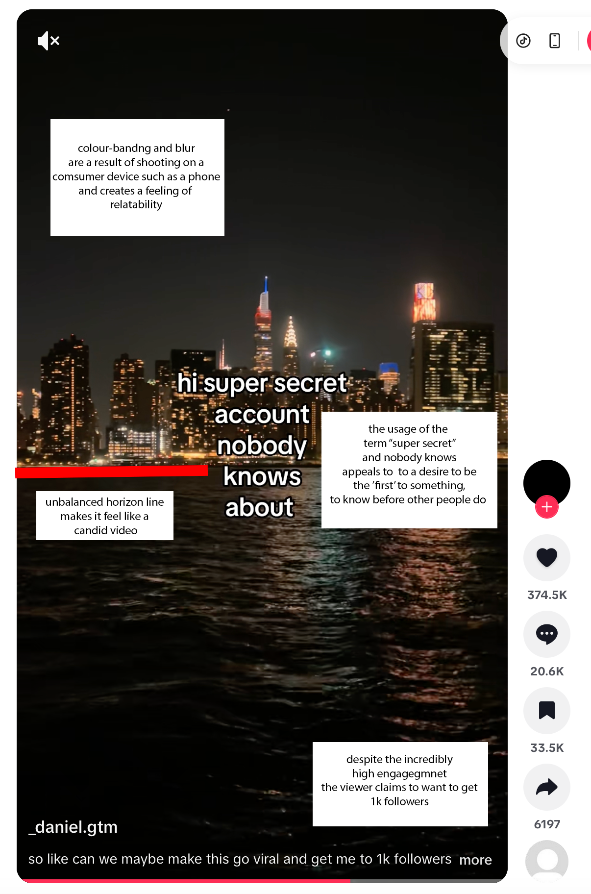
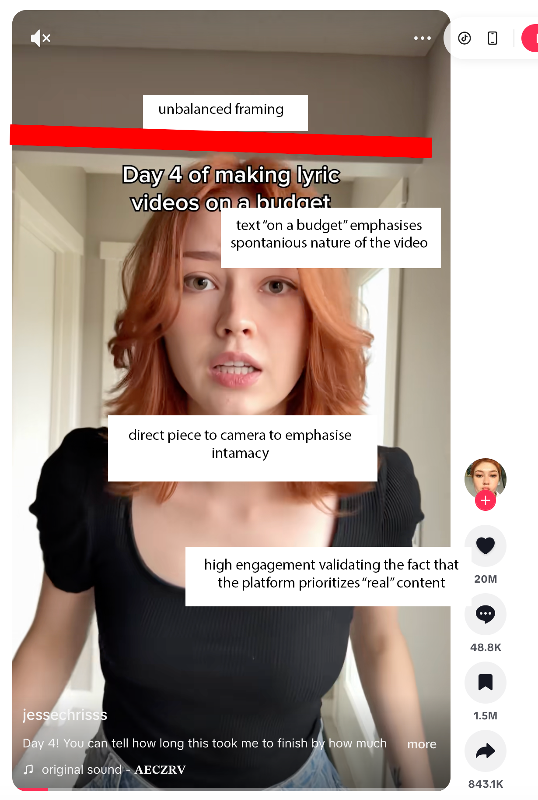

# Calibrated Amateurism on TikTok 
Calibrated amateurism simply put is content that looks casual, messy or unpolished with the intention of being designed to feel "*authentic*".

Creators on the platform frequently use slightly messy framing, minimal transitions and talk to directly to the camera to simulate spontaneity. However, these elements are often methodically constructed to maximize engagement and trust with audiences. 

TikTok's algorithm has set 'rules' that play a key role in shaping this behavior. The 'For You' page prioritises content that appears engaging and personal, encouraging creators to present themselves as "everyday users" rather than highly produced influencers. Features such as short-form video, easy editing tools and algorithmic distribution allow this style of content to thrive. 

Complimenting this, the relationship between creators and audiences has been drastically influenced by this perceived authenticity. Viewers are much more likely to engage with content that feels genuine, even when it becomes carefully curated. The result of this shows that calibrated amateurism becomes a major interaction pattern, minimizing the line between reality and performative creation. This trend links to how users trust the platform and how credibility is constructed. 

### Bibliography
Daniel G.TM [@_daniel.gtm]. (n.d.). _TikTok video_ [Video]. TikTok. [https://www.tiktok.com/@_daniel.gtm/video/7623006545952967949](https://www.tiktok.com/@_daniel.gtm/video/7623006545952967949)

Jesse Chrisss [@jessechrisss]. (n.d.). _TikTok video_ [Video]. TikTok. [https://www.tiktok.com/@jessechrisss/video/7598623176796458261](https://www.tiktok.com/@jessechrisss/video/7598623176796458261)

Abidin, C. (2017, September 18). _Instagram, Finstagram, and calibrated amateurism_. Cyborgology. [https://thesocietypages.org/cyborgology/2017/09/18/instagram-finstagram-and-calibrated-amateurism/](https://thesocietypages.org/cyborgology/2017/09/18/instagram-finstagram-and-calibrated-amateurism/?utm_source=chatgpt.com)

> [!NOTE] Rational
> This case study examines TikTok and teh concept of calibrated amateurism, where published content is made to intentionally look unpolished with the hope of coming off as 'authentic' despite being carefully contstructed to maximise engagement. 
> 
> TikTok is particularly suited to the idea of calibrated amateurism due to the nautre of short-form video, accessible editing tools and the structure of the "For You" page. The selected examples demonstrate how creators may use tools such as informal framing, direct pieces to camera and phrasing to build trust and encourage interaction. 
> 
> This case study highlights how platforms algorithms and user expectations work together to mitigate genuine self-expression and replace it with strategic SEO performance, and how this influences both creator behavior and audience engagement. 
